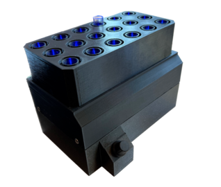

# Optogenetic Lab Equipment for Diabetes Research

This repository offers a detailed overview of the optogenetic lab equipment project, a collaboration with Sahlgrenska Academy and Oxford University.

By: Anton Hagsér, Anton A, Axel H

## Introduction

This project aimed to design a specialized tool tailored for diabetes research, focusing on the study of delta cells.

## Project Background

### Objective

To create optogenetic lab equipment that meets the specific requirements of diabetes research at Sahlgrenska Academy and Oxford University.

### Design

The equipment was designed with adaptability in mind, allowing researchers to focus on delta cells, a component that's gaining attention in diabetes research.

#### Key Features

- **Photoactivation**: Designed to photostimulate specific proteins within delta cells, inducing desired behaviors.
- **Adjustable Light Intensity**: Built with variable light settings for diverse experimental needs.
- **Modular Design**: Ensures adaptability for various research scenarios.
- **User Experience**: A straightforward interface for ease of use by researchers.

## My Contribution

- **Collaboration**: Facilitated communication between our team and the partner institutions to align our design with research needs.
- **Design**: Created a modular design that allows for easy assembly and disassembly of the equipment.
- **Prototyping**: Built a prototype of the equipment to test the design and functionality.
- **Documentation**: Wrote a detailed report of the project, including the design process, prototype testing, and future recommendations.
- **Problem Solving**: Addressed technical challenges and ensured smooth team dynamics.

## Reflections

This project was a hands-on extension of our classroom studies. It reinforced the importance of teamwork, the challenges of creating a tool from scratch, and the nuances of client interactions. It was a valuable experience in understanding how technology can support medical research.

## Appendix

1. [CAD Files](./Appendix/GA.f3z)
